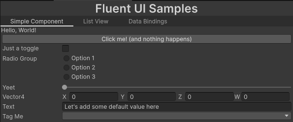

# Fluent UI

**Fluent UI** is an extension library for the Unity **UI Toolkit** framework.  
It adds a set of **fluent-style extension methods** that make creating and configuring UI elements more expressive and concise — helping you build UI trees in a more functional, chainable, and readable way.

---

## Features

#### Pros
- Fluent, chainable API for building UI with UI Toolkit
- *Should have* no runtime overhead — purely syntactic sugar
- Developed on Unity 6000.0.60f1, but can be generated on other versions
- Supports runtime data bindings with simple API (`.BindProperty()` like `.BindText("Text")`)

#### Cons
- Since it's built on top of extensions, it can pollute IntelliSense

## Usage
1. I recommend putting your UI code into special assembly to avoid polution whole project with the extension methods
2. Put `using FluentUI` at the top of you file and it should work

## Known Issues
- Explicit event implementations are ignored and not generated for interface (ITextSelection for example)

## Examples

Instead of writing verbose, object-oriented UI setup code:

```csharp
var label = new Label();
label.text = "Hello World";
label.style.unityTextAlign = TextAnchor.MiddleCenter;
label.AddToClassList("header");
root.Add(label);
```

You can write the same thing fluently:

```csharp
root.Children(
    new Label()
        .Classes("header")
        .Text("Hello World)
        .Style(static style => style.UnityTextAlign(TextAnchor.MiddleCenter))
)
```

Or even create whole hierarchies (that's where it gets even better) like this:

```csharp
// Normal way
var button = new Button(() => Debug.Log("Clicked!"));
var label = new Label() {
    text = "Welcome to Fluent UI"
};
var ve = new VisualElement();
ve.AddToClassList("container");
ve.Add(button);
ve.Add(label);
root.Add(ve);

// Fluent UI way
root.Children(
    new VisualElement()
        .Classes("container")
        .Children(
            new Button(() => Debug.Log("Clicked!"))
                .Text("Click Me"),
            new Label()
                .Text("Welcome to Fluent UI")
        )
    );
```

Some more samples are available in project under `UnityProjects/Assets/Fluent UI/Samples Window`.



## Installation
Use `Install from git URL` in Package Manager with this url: `https://github.com/Mirovsky/fluent-ui.git?path=/UnityProject/Packages/com.mirovsky.fluent-ui`

## TODO
- Generator code is not perfect and some methods or fields might be missing, let me know what you think should be there
- Generate extensions for Unity Editor assembly and have them conditionaly compiled / in editor only assembly
